# New York Citi Bike Service Analysis

## Introduction
As the newly appointed lead analyst for the New York Citi Bike program, I am excited to leverage the data from 2022 and 2023 to provide insights into the program's utilization. Despite collecting data since 2013, there's currently no dashboard or sophisticated reporting system in place.
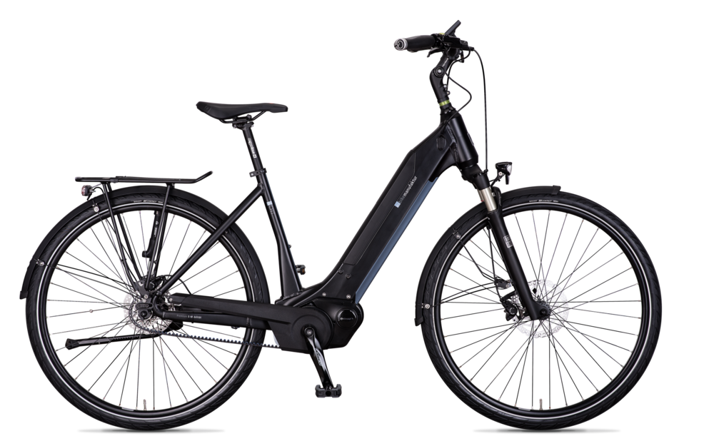
 City officials seek insights to publicize and improve the program. My goal is to analyze the data from these two years and develop concise and insightful reports to inform decision-making and enhance the success of the Citi Bike program.

## Report:

### User Type(Casual vs Member):
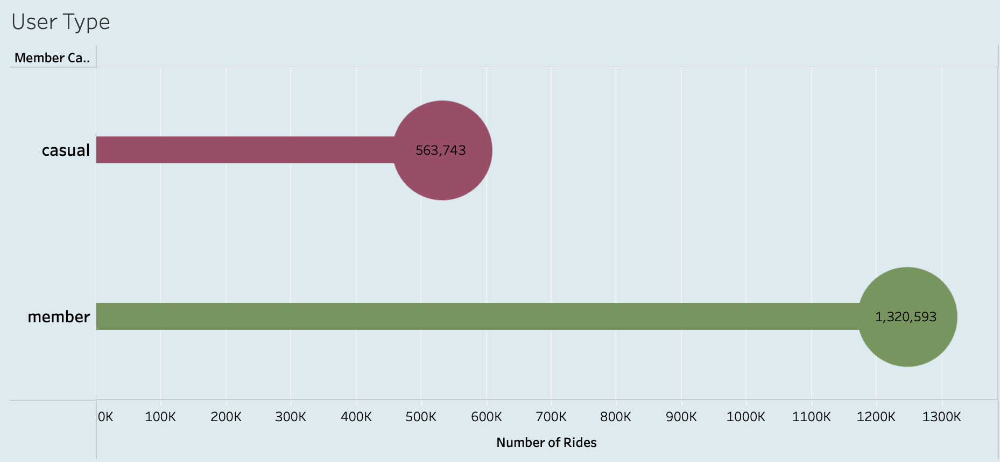
Based on the provided data, thereare significantly more members (1,320,593) than casual users(563,743) in the Citi Bike system. The higher number of members compared tocasual users suggests that members areusing the Citi Bike system morefrequently. This is likely because members have access to more affordable and convenient ride options through their membership plans.

### Popular Months by User Type:
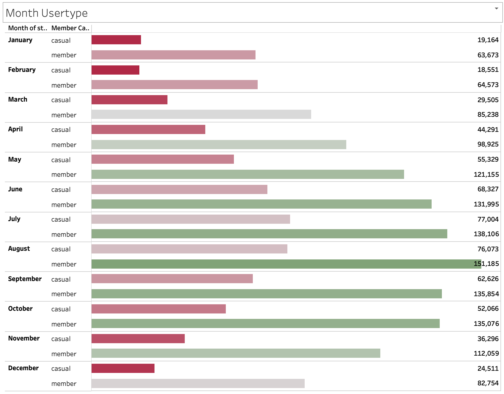
During the summer season in August, when 68,327 people are more likely to engage in outdoor activities, including biking, there were 151,185 members in the Citi Bike system, indicating a significant user base with ongoing access to the service. Conversely, data shows that casual customers logged a total of 77,004 and 76,073 rides, indicating their intermittent use of the service during the summer months.

### Ride Types:
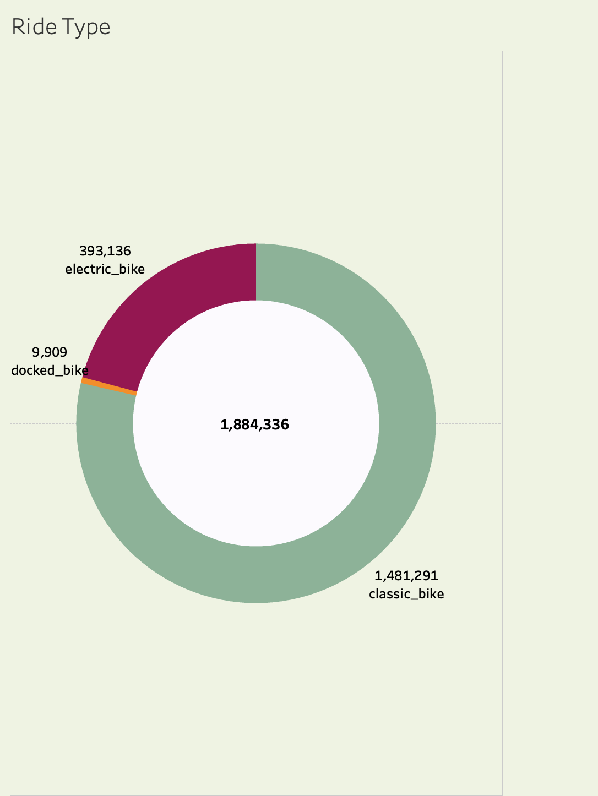
Classic bikes, totaling 1,481,291 rides, have been extensively utilized within the Citi Bike system. These traditional pedal-powered bicycles are favored by many users for their simplicity and accessibility, making them ideal for short-distance trips, commuting, and leisure rides around the city.

Electric bikes have also seen substantial usage, with a total of 393,136 rides. Offering an additional level of convenience and speed compared to classic bikes, electric bikes are popular among users seeking a faster and more effortless riding experience. They are often preferred for longer-distance trips, hilly terrains, and for users seeking assistance with pedaling.

Despite being a smaller segment, docked bikes have garnered 9,909 rides within the Citi Bike system. These traditional bicycles are parked and locked at designated docking stations after each use. While docked bikes may be less prevalent than their dockless counterparts, they still cater to users who prefer the reliability and predictability of docking stations, especially for longer rides or commuting purposes.

### Rides Types Trends:
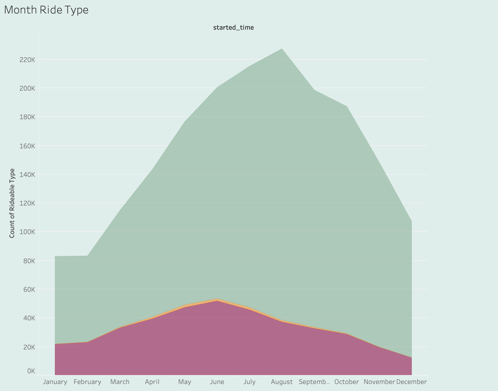
In August, classic bikes experienced a peak in usage, with a total of 188,879 rides recorded within the Citi Bike system. August is a peak tourism month in many cities, including New Jersey, attracting visitors from around the world. Tourists may opt for classic bike rentals to explore the city's attractions, landmarks, and scenic routes at their own pace, contributing to the increased demand for classic bikes during this month.

### Top 10 locations 

The Grove Street PATH station holds the top position in terms of ridership within the Citi Bike system, with a total of 89,566 riders recorded at City Hall - Washington during the specified period. Several factors contribute to the station's high ridership count:

Strategic Location: Grove Street PATH station is strategically situated in Jersey City's downtown area, particularly at Monmouth Street and Hoboken Avenue. This positioning makes it a major transportation hub for commuters traveling to and from Manhattan via the PATH train. Its central location and accessibility attract a large volume of commuters, residents, and visitors, thereby contributing to the high demand for Citi Bike rentals at this station.

Population Density: The surrounding area of Grove Street PATH station is densely populated, characterized by a mix of residential neighborhoods, commercial establishments, and cultural attractions. The station serves as a crucial transit point for residents living in nearby apartment buildings, condominiums, and townhouses, as well as for employees commuting to various destinations.

### Popular Routes:

The route from Hoboken Ave at Monmouth St to Hoboken Terminal at Hudson St and Hudson IP has recorded a significant travel count of 11,040 rides. This route connects residential neighborhoods in the western part of Hoboken to Hoboken Terminal, a major transportation hub serving PATH trains, NJ Transit buses, and ferries. Many commuters residing in this area use Citi Bike as a convenient and efficient mode of transportation for their daily commute to work or school.

### Bottom 10 Stations:

These bottom 10 stations have only one count of rider, it could be due to several reasons:

Low Traffic Area: The station may be situated in an area with low foot or bike traffic. This could be a less populated or less frequented neighborhood, resulting in minimal usage of the station.

Limited Accessibility: The station may have limited accessibility or visibility, making it less convenient for riders to access or use.

### Weekdays vs Weekends:
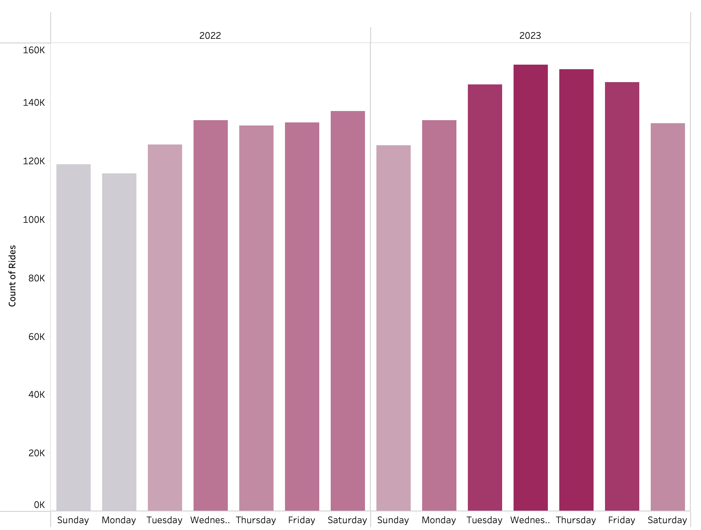
There was an increase in riders' count from 2022 to 2023 on weekdays, it could be due to Return to Office Policies. Many companies and organizations may have implemented policies that require employees to return to the office, leading to an increase in commuters utilizing Citi Bike for their weekday travels. Additionally, the increase in ridership could be attributed to improving economic conditions, expansions in bike infrastructure, promotional campaigns, or other factors contributing to the popularity and accessibility of Citi Bike services.

### Months Trends(2022 vs 2023)
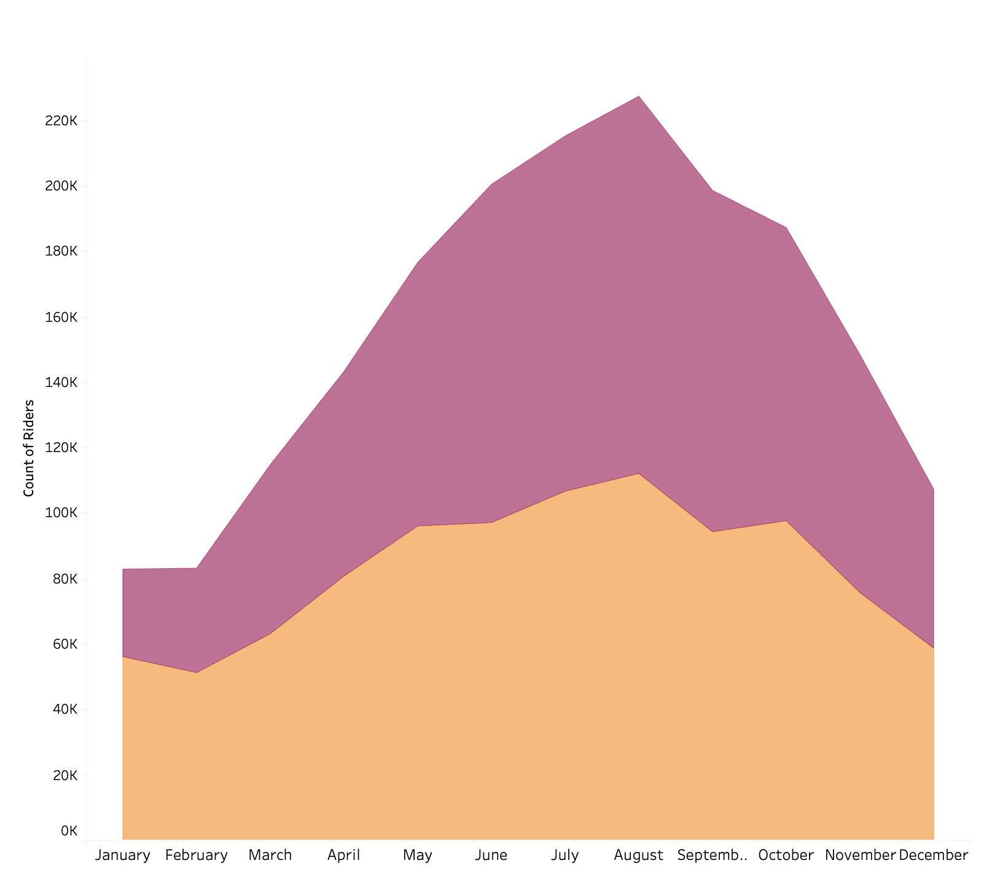
In August 2023, there was a notable surge in the number of cyclists, attributed to a widespread return to normalcy after the COVID-19 pandemic. With the easing of restrictions and growing confidence in public transport, many people chose cycling as a safer and more socially distanced mode of transportation."

### Hourly Trends:
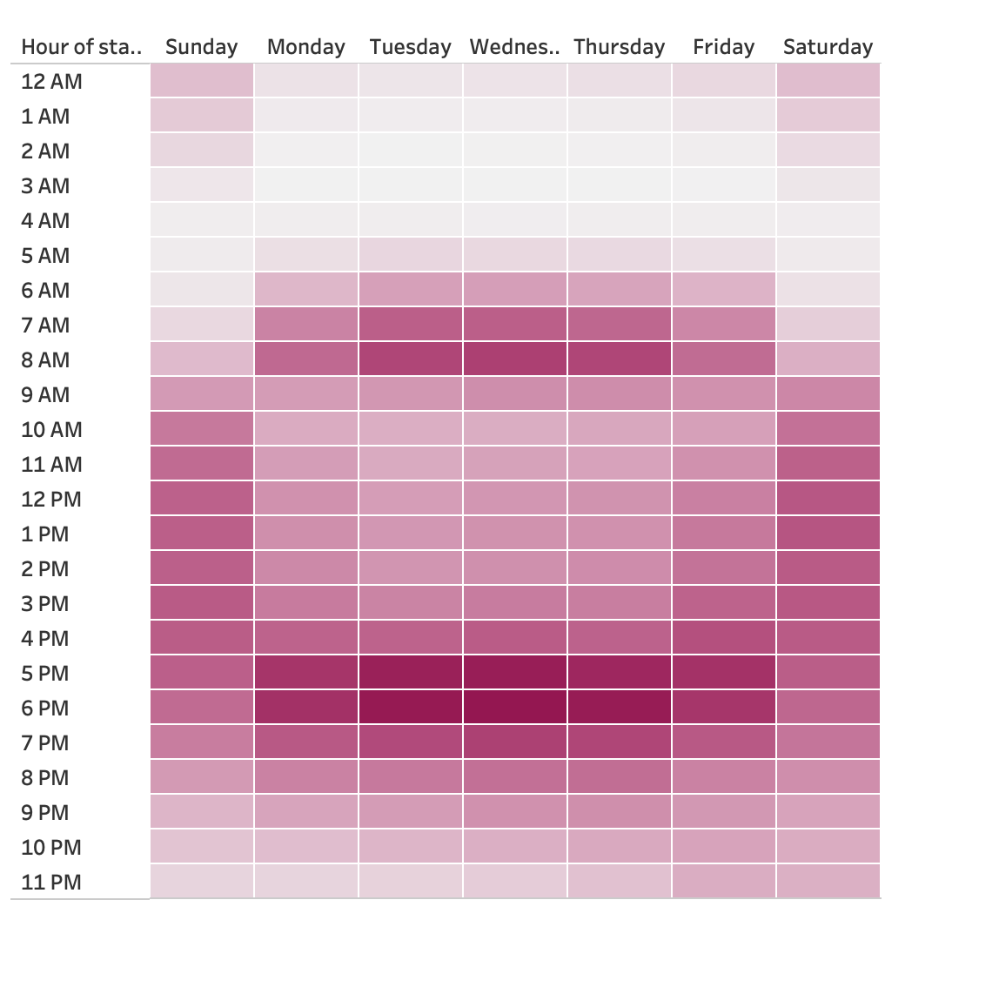
Citi Bike usage peaks on weekdays, especially between 5 to 6 PM, with a noticeable spike on Wednesdays. This surge is likely due to commute hours, as people travel back home from work or school. The mid-week peak on Wednesday could reflect the culmination of a full day's work, aligning with the traditional rush hour. On weekends, a different pattern emerges, with usage intensifying from 10 AM to 7 PM. This shift towards leisure and recreation sees individuals utilizing Citi Bike for city exploration, visiting parks, waterfronts, tourist sites, or attending outdoor events and festivals, contributing to the heightened activity during these times.

## Dashboard  Analysis:

### Citi Bike Dashboard:
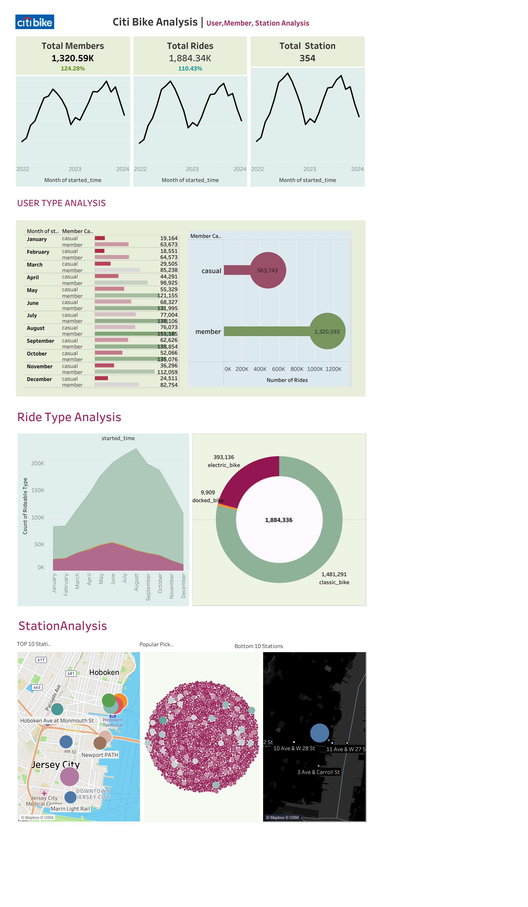
In the Citi Bike system, members significantly outnumber casual users, indicating higher usage frequency due to more affordable and convenient ride options. August exhibits peak engagement with 151,185 members, while casual users show sporadic activity during summer months. Classic bikes are the most popular, followed by electric bikes, with docked bikes catering to reliability seekers. Classic bikes peak in August, possibly due to increased tourism. The Grove Street PATH station leads in ridership, benefiting from its strategic location and high population density. The route from Hoboken Ave at Monmouth St to Hoboken Terminal is heavily traveled, serving commuters from residential areas to major hubs. Conversely, bottom 10 stations with only one rider each may suffer from low traffic or limited accessibility.

### Peak Time Trends:
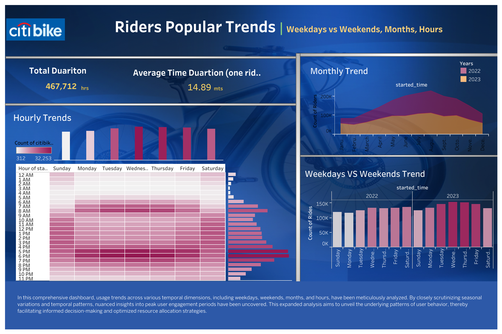)
Weekday ridership increased from 2022 to 2023, possibly due to return-to-office policies and improving economic conditions. August 2023 saw a surge in cyclists, signaling a return to normalcy post-COVID-19. Peak Citi Bike usage occurs on weekdays around 5-6 PM, driven by commuting, with Wednesdays showing the highest activity. Weekends see heightened usage from 10 AM to 7 PM, reflecting leisure and recreational activities.

## Citi Map Analysis:
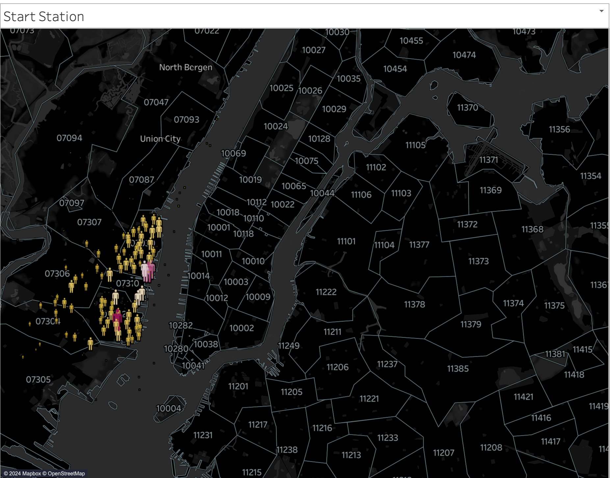
The start and end stations attracts commuters and residents due to its strategic location and high population density. The popular route serves commuters from residential areas to major transportation hubs, offering convenience and accessibility. 

Conversely, the bottom ranking stations experience minimal usage likely due to low traffic areas or limited accessibility, leading to their low rider counts.

## Conclusion:
In conclusion, the analysis underscores the significance of strategic location and accessibility in driving ridership within the Citi Bike program. Key insights reveal a preference for classic bikes among members, with peak engagement observed in August, potentially influenced by tourism. The Grove Street PATH station emerges as a top location, benefiting from its central position and high population density, while the route from Hoboken Ave to Hoboken Terminal serves as a crucial commuter pathway. Conversely, stations with minimal usage indicate challenges related to low traffic areas or limited accessibility. Overall, understanding these patterns is essential for optimizing service delivery and enhancing the overall success of the Citi Bike program.

